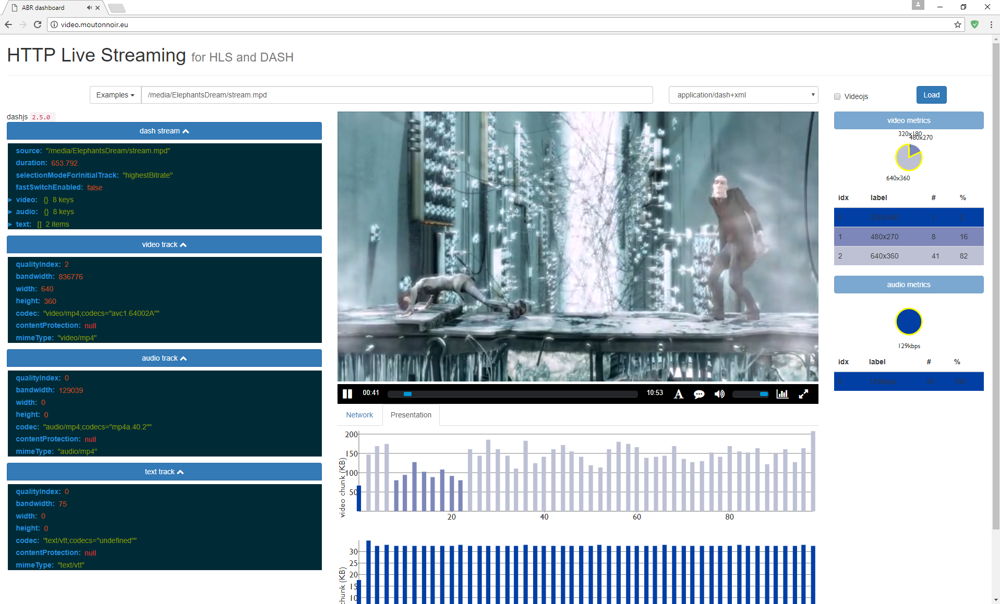

# >> [Live demo](http://video.moutonnoir.eu/) <<

## Screenshot



# Introduction

react-adaptive-streaming is a web applicaton whose purpose is to demonstrate adaptive bitrate streaming techniques, namely [DASH](http://dashif.org/about/) and [HLS](https://developer.apple.com/streaming/). We use the advantage of [React component's lifecycle](https://facebook.github.io/react/docs/state-and-lifecycle.html) together with composition to swap rendering video elements from the DOM, alternatively between the three players [dash.js](https://github.com/Dash-Industry-Forum/dash.js), [hls.js](https://github.com/video-dev/hls.js/tree/master) and [videojs](https://github.com/videojs/video.js).

# Media files

See [https://github.com/matmoi/create-DASH-HLS](https://github.com/matmoi/create-DASH-HLS) for instructions on how to encode the different streams properly.

# Requirements

- [nodejs](https://nodejs.org/en/download/)

> for Windows 10 users :
> I strongly recommend running npm/nodejs from the [Bash](https://msdn.microsoft.com/en-us/commandline/wsl/about) environment, it makes the installation process much less painful !

# In-browser visualization

Install depencencies with :
```
npm install
```

and run server in dev mode using :
```
npm start
```

Then open a web browser at [http://localhost:3000](http://localhost:3000).

To customize the predefined list of sources (the one showing under the "Examples" dropdown button), edit `sources.json` under root directory as following: or each source you must specify the url (or relative path on same server) and mime type, either `application/dash+xml`, `application/x-mpegURL` or `video/mp4`. On first loading, player will automatically pick up first stream of the list.

## Known issues

- As discussed in this [ticket](https://github.com/videojs/videojs-contrib-hls/issues/600), plugin `contrib-video-hls` doesn't support webpack (yet?). In the meantime, we recommend to use the `hls.js` player directly, and not the videojs wrapper.

# Similar tools

- [DashIF reference client](http://dashif.org/reference/players/javascript/latest/samples/dash-if-reference-player/index.html) (DASH only)
- [HLS.js demo page](http://video-dev.github.io/hls.js/demo/) (HLS only)